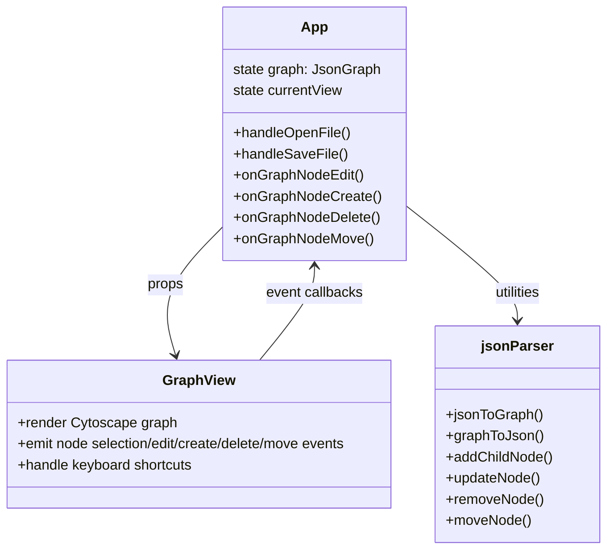
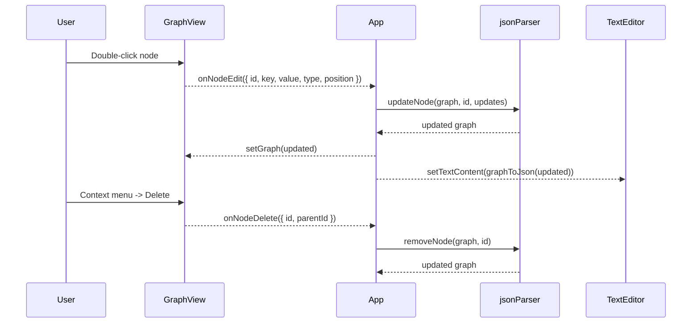

# Architecture Plan (2025-12-31 02:18:22 UTC)

## Repository Snapshot (Abstracted AST Overview)
- **App (`jsonic/src/App.tsx`)**
  - Maintains React state: `currentView`, `graph: JsonGraph`, `textContent`, `currentFile`, `status`.
  - Uses toolbar, graph, text editor, and status bar components.
  - Sync utilities: `jsonToGraph`, `graphToJson` from `utils/jsonParser`.
- **GraphView (`jsonic/src/components/GraphView.tsx`)**
  - Functional component rendering Cytoscape graph from `JsonGraph` nodes/edges.
  - Props: `graph`, `onNodeSelect`, `onNodeEdit`, `onNodeCreate`, `onNodeDelete`, `onNodeMove`.
  - Initializes Cytoscape layout (`breadthfirst`) and registers simple tap handler to select nodes.
- **Types (`jsonic/src/types/jsonTypes.ts`)**
  - `JsonNode` shape with id, type, optional key/value/children/parent/position/comments.
  - `JsonGraph` containing nodes, edges (parent/sibling), metadata.
- **JSON Parser Utils (`jsonic/src/utils/jsonParser.ts`)**
  - Converters between JSON value and `JsonGraph` (bidirectional).
  - Helpers: `findNode`, `addChildNode`, `updateNode` (no delete/move helpers yet).
- **UI Components**
  - Toolbar, TextEditor, StatusBar are present for layout and file operations.

## Proposed Solution (Eventful Graph Editing & Navigation)
1. **GraphView Interaction Layer**
   - Expose rich Cytoscape event hooks:
     - Node **double-tap/double-click** → trigger `onNodeEdit` with `{ id, key, value, type, position }` payload.
     - **Context menu** on node and background → show native `contextmenu` with options (edit, create child, delete, move) via callback payloads.
     - **Drag-and-drop** node moves → on grab/free events capture start/end positions and parent relationship changes, fire `onNodeMove`.
     - **Zoom/pan** events → provide `onViewportChange`-like payload to maintain stable layout (tracking `position`, `zoom`, `pan`).
   - Maintain selection highlighting and keyboard focus mapping (Tab/Shift+Tab cycling nodes, Ctrl+Arrow for parent/child/sibling travel).
2. **App State Mutation**
   - Implement callbacks to mutate `graph` using utility helpers:
     - Add utility helpers for delete, move, connect edges (extend `jsonParser.ts`).
     - Keep node `position` to preserve layout during edits.
     - Re-sync text view after mutations via `graphToJson`.
   - Confirm deletion actions before mutating state.
3. **Context Menus & Keyboard Shortcuts**
   - Provide at least one actionable context menu (e.g., on node: Edit, Add Child, Delete with confirmation, Center View).
   - Keyboard navigation: Tab/Shift+Tab to iterate nodes; Ctrl+Arrow to navigate relationally.

## Diagrams

### Component Interaction (Mermaid UML Class Diagram)


### State & Event Flow (Mermaid Sequence)


## Notes
- External hybrid knowledge graph integrations (Neo4j/Qdrant/Postgres) are **not performed** because external network/stateful writes are disallowed in this environment; architecture kept local.
- The plan prioritizes stable layout by persisting Cytoscape positions and minimizing full relayouts.
```
