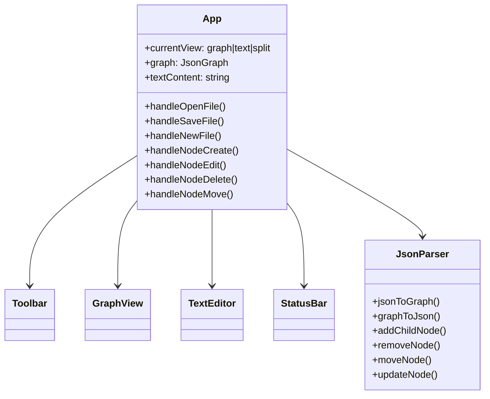
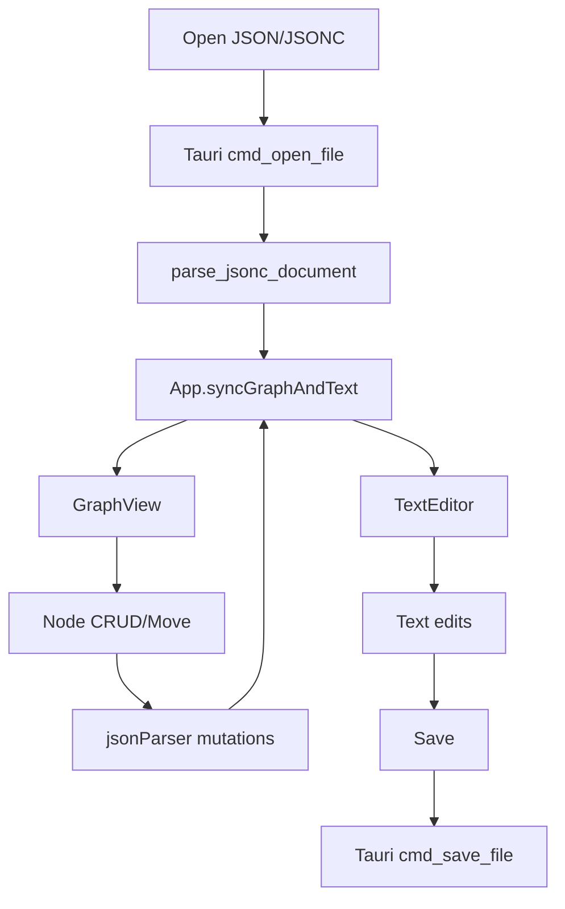

# JSONic Architecture Baseline & Implementation Plan

Timestamp: 2026-04-29T16:11:27Z

## AST-like Repository Abstraction
- jsonic/src/App.tsx
  - state: currentView, graph, textContent, currentFile, status, selectedNodeId
  - handlers: handleOpenFile, handleSaveFile, handleNewFile, handleNode* mutations
  - children: Toolbar, GraphView, TextEditor, StatusBar
- jsonic/src/components/GraphView.tsx
  - Cytoscape wrapper; context menu; keyboard navigation hooks
  - emits: onNodeSelect/onNodeEdit/onNodeCreate/onNodeDelete/onNodeMove/onPositionsUpdate
- jsonic/src/components/TextEditor.tsx
  - textarea editor + save/open shortcuts
- jsonic/src/components/Toolbar.tsx
  - file buttons + view switching
- jsonic/src/components/StatusBar.tsx
  - status text + file/node/edge counters
- jsonic/src/utils/jsonParser.ts
  - jsonToGraph, graphToJson, findNode, addChildNode, updateNode, removeNode, moveNode
- jsonic/src-tauri/src/commands.rs
  - cmd_open_file, cmd_save_file, cmd_parse_json_with_comments, cmd_stringify_json_with_comments

## UML (Mermaid)

## MMD Flow

## Proposed Completion Scope
1. Enforce README keyboard behavior:
   - TAB: create child
   - SHIFT+TAB: focus parent
   - ENTER: create sibling
   - CTRL+Arrow: navigate parent/child/siblings
2. Add global Ctrl/Cmd+O and Ctrl/Cmd+S in App.
3. Support creating first/root node in empty graph from GraphView.
4. Keep graph/text synchronized when editing text with parse validation feedback.
5. Add menu-like toolbar labels (File/Edit/View/Help placeholders) and About metadata.
6. Expand status bar with version/build stamp.

## Neo4j Alignment Note
No Neo4j runtime/config exists in repo; architecture mapping is documented here as canonical artifact for later graph ingestion.
