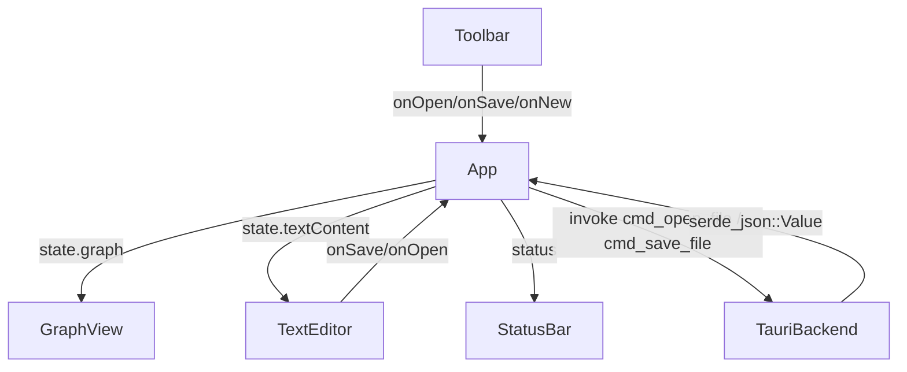
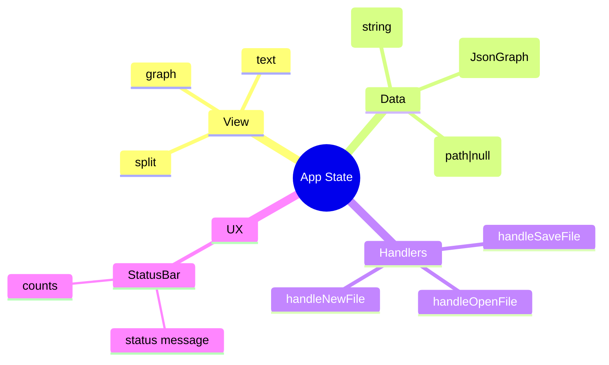

# JSONIC Editor Architecture — 2025-12-31 01:23:46 UTC

## Scope
- Repository: `/workspace/jsonic-editor/jsonic`
- Targeted change set: Frontend state handling in `src/App.tsx`, error surfacing, and alignment with Tauri commands `cmd_open_file` / `cmd_save_file`.

## Abstracted AST & Component Graph
- `App`
  - State: `currentView`, `graph: JsonGraph`, `textContent: string`, `currentFile: string | null`, `status: { level: 'info' | 'error'; message: string }`
  - Handlers: `handleOpenFile()`, `handleSaveFile()`, `handleNewFile()`, `syncGraphAndText(jsonValue: any)`
  - Renders: `Toolbar`, `GraphView`, `TextEditor`, `StatusBar`
- `Toolbar`
  - Props: `onOpen`, `onSave`, `onNew`, `onViewChange`, `currentView`
- `GraphView`
  - Props: `graph`, node callbacks (select/edit/create/delete/move)
  - Visualization via Cytoscape
- `TextEditor`
  - Props: `content`, `onChange`, `onSave`, `onOpen`
  - Keyboard shortcuts bind to shared handlers
- `StatusBar`
  - Props: `currentFile`, `nodeCount`, `edgeCount`, `status`
- Utilities
  - `jsonParser.ts`: `jsonToGraph(json)`, `graphToJson(graph)`
- Backend (Tauri)
  - Commands: `cmd_open_file(path?) -> serde_json::Value`, `cmd_save_file(path?, content: Value) -> ()`
  - JSONC comment preservation cached by path

## Proposed Behavior Flow (AST-Level)
1. `handleOpenFile`
   - `invoke('cmd_open_file', { path?: currentFile })`
   - On success: `syncGraphAndText(jsonValue)` -> updates `graph`, `textContent`; set `currentFile` if path known/returned; set status info.
   - On error: set status error message for `StatusBar`.
2. `handleSaveFile`
   - Derive `jsonValue` from current `graph` via `graphToJson` when graph is authoritative; when text edits present, parse `textContent` (JSON.parse) to align both states.
   - `invoke('cmd_save_file', { path: currentFile, content: jsonValue })`
   - On success: status info; optionally update `currentFile` from response metadata if available.
   - On error: status error message.
3. `handleNewFile`
   - Reset `graph` to empty template, `textContent` to '', `currentFile` to null, clear status.
4. `StatusBar`
   - Display file path and latest status (errors prioritized).
5. Handler reuse
   - Same handler references passed to `Toolbar` and `TextEditor`; graph/text views rely on shared state.

## UML (Component Interaction)

## Mermaid Mind Map (State + Data Flows)

## Notes & Assumptions
- Tauri command identifiers used: `cmd_open_file`, `cmd_save_file`.
- When the backend does not return a path (file picker), `currentFile` may remain `null`; consider future backend extension to include selected path.
- Error propagation will surface in `StatusBar`; the structure supports swapping to a toast system without reworking handlers.
