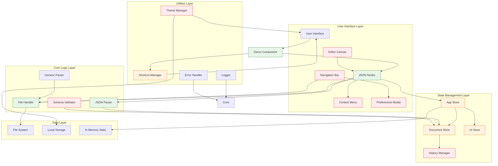
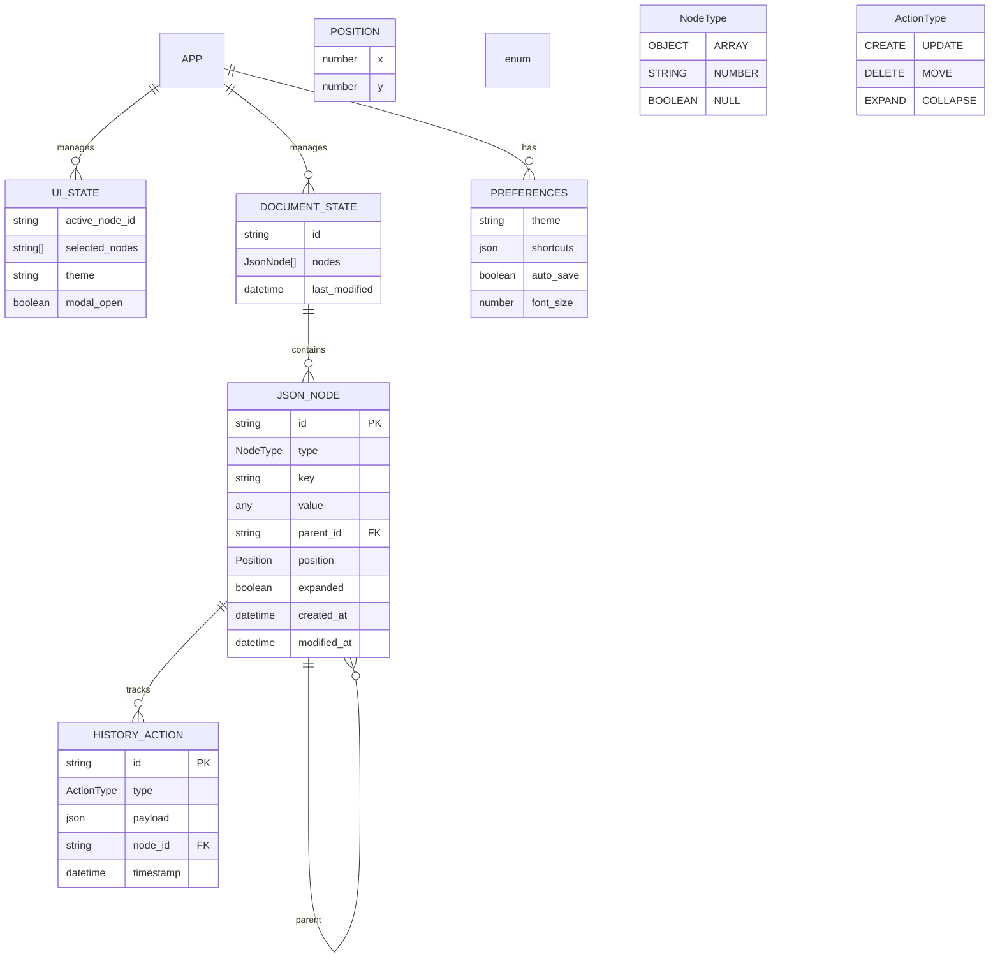

# JSONIC Editor Architecture Analysis - 15 Sep 2025

## Executive Summary

The JSONIC Editor project is a partially implemented web-based JSON editing application that aims to provide a visual, concept-map-like interface for editing JSON files. The project has a solid foundation with React, TypeScript, and Vite, but is currently in a demo/prototype state rather than being a fully functional application.

## Current State Analysis

### ✅ What's Implemented (Core Foundation)

#### 1. **Project Infrastructure**
- **Build System**: Vite with React 18 and TypeScript
- **Package Management**: Complete package.json with all necessary dependencies
- **Directory Structure**: Well-organized following the planned architecture
- **Build Configuration**: Working vite.config.ts with proper aliases and build settings

#### 2. **Core Type System** (`src/types/core.ts`)
- Complete `JsonNode` interface with support for all JSON types
- Position and expansion state management
- Document and UI state interfaces
- History action types

#### 3. **JSON Parsing Engine** (`src/core/parser/json-parser.ts`)
- Full JSON parsing and serialization
- Type detection and conversion
- UUID generation for nodes
- Basic validation

#### 4. **File I/O System** (`src/core/file-io/file-handler.ts`)
- Browser-based file opening and saving
- Multi-format support (JSON, YAML, TOML, INI)
- Generic parser integration
- Blob API usage for downloads

#### 5. **Advanced Node Component** (`src/components/nodes/json-node.tsx`)
- Complete visual node representation
- Drag-and-drop functionality with react-dnd
- In-line editing for all data types
- Context menu support
- Expand/collapse functionality
- Multi-selection support
- Add child nodes dynamically

#### 6. **Demo Application** (`src/components/demos/JsonNodeDemo.tsx`)
- Working prototype showcasing all features
- File operations (open/save)
- Node manipulation
- Interactive testing ground

#### 7. **Styling System**
- Comprehensive CSS with multiple themes
- Component-specific styling
- Responsive design considerations
- Multiple visual themes (light, dark, skeuomorphic, retro, glassmorphic, brutalist)

### ⚠️ What's Partially Implemented

#### 1. **State Management**
- Basic store structures exist (`src/state/stores/`)
- App store and UI store skeletons
- Missing integration with main application
- No persistence or advanced state management

#### 2. **Utilities and Helpers**
- Logger, error handler, and theme manager exist
- Keyboard shortcuts partially implemented
- Missing integration points

#### 3. **Core Logic Components**
- History manager and schema validator exist
- Not fully integrated into the main application flow

### ❌ What's Missing (Critical Gaps)

#### 1. **Main Application Integration**
- `App.tsx` only shows the demo component
- No integration of actual editor components
- Missing navigation bar, canvas, and modal systems
- No real application state management

#### 2. **Keyboard Navigation System**
- Keyboard shortcuts defined but not integrated
- Missing global keyboard event handling
- No Tab/Shift+Tab navigation between nodes
- No arrow key navigation

#### 3. **Visual Canvas System**
- No actual canvas-based rendering
- Missing spatial positioning of nodes
- No visual concept-map layout
- No panning/zooming functionality

#### 4. **Context Menu System**
- Component exists but not implemented
- No right-click functionality
- Missing node-specific actions

#### 5. **Preferences System**
- Modal component exists but empty
- No theme switching functionality
- No user preference persistence

#### 6. **Error Handling and Validation**
- Basic error handlers exist
- No real-time JSON validation
- No user-friendly error messages

#### 7. **Testing Infrastructure**
- Vitest configured but no tests
- No test coverage
- CI/CD pipeline missing

## Architecture Flowchart

## Entity Relationship Diagram

## Current Implementation Issues

### 1. **TypeScript Errors**
- React-DnD import issues (useDrag, useDrop not found)
- Missing type definitions for 'ini' package
- Props interface mismatches

### 2. **Architecture Gaps**
- Main application only shows demo
- Missing integration of components
- No actual canvas implementation
- No real state management

### 3. **Missing Features**
- No visual concept map layout
- No keyboard navigation
- No proper preferences system
- No validation feedback

## Critical Path to Completion

### Phase 1: Foundation Fixes (Immediate)
1. Fix TypeScript errors
2. Update React-DnD imports
3. Add missing type definitions
4. Integrate main application components

### Phase 2: Core Implementation (1-2 weeks)
1. Replace demo with actual canvas
2. Implement spatial node positioning
3. Add keyboard navigation
4. Complete state management integration

### Phase 3: Feature Completion (2-3 weeks)
1. Implement context menus
2. Add preferences system
3. Complete validation system
4. Add theme switching

### Phase 4: Polish and Testing (1 week)
1. Comprehensive testing
2. Performance optimization
3. Documentation updates
4. Deployment preparation

## Risk Assessment

### High Risk
- React-DnD version compatibility issues
- Performance with large JSON files
- Complex state management requirements

### Medium Risk
- Browser compatibility for file operations
- CSS theming consistency
- User experience design gaps

### Low Risk
- Build system stability
- TypeScript integration
- Basic component functionality

## Recommendations

1. **Immediate**: Fix TypeScript errors and React-DnD issues
2. **Short-term**: Implement actual canvas system with spatial positioning
3. **Medium-term**: Complete state management and keyboard navigation
4. **Long-term**: Add advanced features and comprehensive testing

The project has excellent potential with a solid foundation, but requires significant architectural integration work to become a functional JSON editor application.