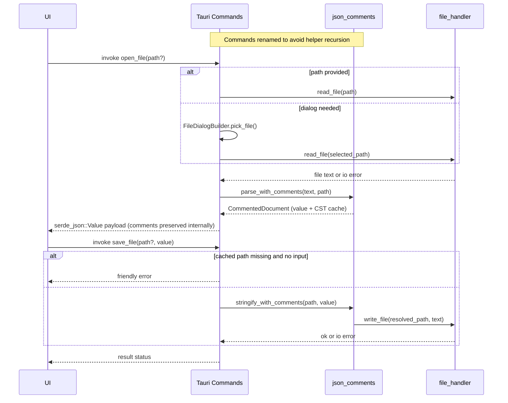
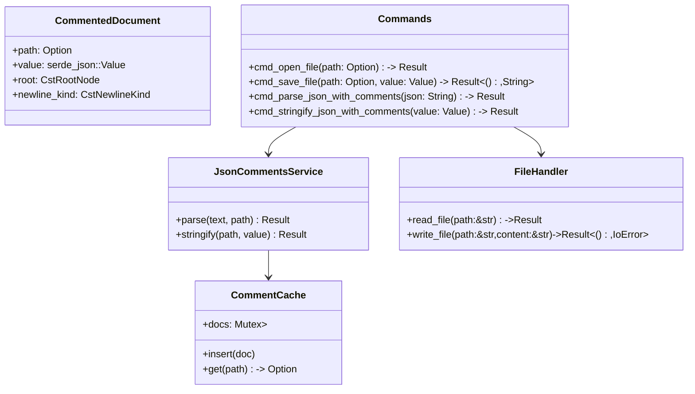

# Architecture & AST Plan — 2025-12-31 00:24 UTC

> Note: External hybrid knowledge graph endpoints (Neo4j/Postgres/Qdrant) are inaccessible in this environment, so synchronization is deferred.

## Baseline AST / Module Inventory
- `src-tauri/src/main.rs`
  - Registers Tauri commands: `open_file`, `save_file`, `parse_json_with_comments`, `stringify_json_with_comments`.
- `src-tauri/src/commands.rs`
  - Thin Tauri command wrappers calling helpers in `file_handler.rs` and `json_comments.rs`.
  - Current risk: helper/import name collisions cause self-recursion for JSON comment functions.
- `src-tauri/src/file_handler.rs`
  - Low-level `read_file`, `write_file` using std fs APIs; minimal error context.
- `src-tauri/src/json_comments.rs`
  - Placeholder JSON parsing/stringifying via `serde_json` (no comment support).
- Dependencies: `tauri` (dialog/fs features), `serde`, `serde_json`.

## Proposed Additions / Revisions
- Introduce `jsonc-parser` (with `serde` + `cst` features) to parse JSONC, capture comment positions, and re-stringify while preserving trivia.
- Create a reusable struct `CommentedDocument` encapsulating:
  - Parsed `serde_json::Value` for app consumption.
  - `CstRootNode` for comment/format retention.
  - Original path + newline/indent style for stable round-tripping.
- Maintain an in-memory cache keyed by absolute path to reuse comment layouts when saving.
- Harden error handling with user-friendly messages and context (path, action, root cause).
- Integrate `tauri::api::dialog::FileDialogBuilder` to select open/save paths when none provided.
- Expose non-recursive command wrappers (e.g., `cmd_parse_json_with_comments`) that delegate to helpers.
- Add unit tests covering:
  - Comment-preserving parse/stringify round-trips.
  - Open/save flows with comment retention and dialog bypass (direct path use).
  - Error propagation for missing files and write failures.

## Data Flow (Mermaid Sequence)

## Structural Relationships (UML-ish Mermaid)

## Edge Cases & Error Strategy
- Missing path -> prompt via dialog; if canceled, return explicit "No file selected" message.
- IO errors -> wrap with actionable guidance (permission denied, not found).
- Parse errors -> include snippet location when available from `jsonc-parser` diagnostics.
- Save with stale cache -> fallback to formatted JSONC without comments but warn in message.

## Testing Plan (overview)
- Unit tests in `src-tauri/src` exercising commands directly.
- Use `tempfile` for isolated file system checks.
- Verify round-trip: write sample JSONC with line/inline comments, parse, stringify, compare normalized output retaining comments structure.
